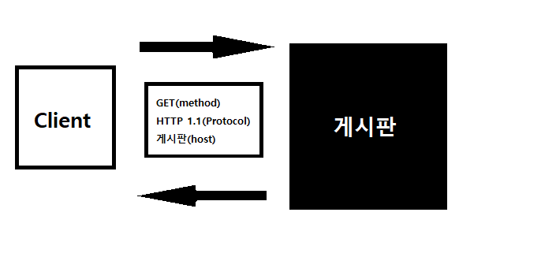

# 20191022_

- cookie 보내기

```python
def send_cookie(request):
    res = HttpResponse('과자 받아랏!ㅋㄷ')
    res.set_cookie('mycookie', 'oreo') # cookie를 직접 만들어 보내는 것 cookie : key value type의 method
    return res
```

- 
- cookie는 browser에 저장된다.
  - 브라우저를 끄면 쿠키도 날아간다. 
- session는 server에 저장된다.
  - 서버를 끄면 세션도 날아간다.
  - session을 이용하여 방문 횟수 count를 세기도 한다.
  - 현재는 session-based login을 쓰고 있다.



## 기타

- 팝업창 끄기 쿠키를 남기거나, 인증 완료 쿠키 등을 남기기도 한다.

- middleware : django ORM, DTL(template에 대한 middleware) 어떤 기능을 돌아가게 하는 데에 중간에 위치하여 그 기능을 control할 수 있게 하는 단

  - settings.py

  ```python
  MIDDLEWARE = [
      'django.middleware.security.SecurityMiddleware',
      'django.contrib.sessions.middleware.SessionMiddleware',
      'django.middleware.common.CommonMiddleware',
      'django.middleware.csrf.CsrfViewMiddleware',
      'django.contrib.auth.middleware.AuthenticationMiddleware',
      'django.contrib.messages.middleware.MessageMiddleware',
      'django.middleware.clickjacking.XFrameOptionsMiddleware',
  ]
  ```

- embed() : 코드를 쓴 곳이 실행될 시 브라우저의 스피너가 돌면서 콘솔이 켜진다

- 쿠키, 세션, (캐시)

  - 이 개념은 http가 connectionless, stateless하기 때문에 나온 것이다.

  - 쿠키는 user가 들고 있는 것

  - 세션은 user의 정보를 server가 갖고 있는 것

  - 캐시는 브라우저가 일시적으로 쥐고 있는 것(computer science 전반적으로 쓰인다.)

    원래의 저장소로 data를 주고 받는 것이 cost가 크기 때문에 생긴 개념

    cache는 상대적인 개념

    브라우저가 caching한다는 것은 server에서 받아온 것들 중 다시 받아올 필요가 없는 data들을 쥐고 있는 것을 말한다. (cost를 줄이기 위함)

- CPU(계산)의 임시 저장소를 둬 계산 능력을 증대시켰다. 이 저장소를 registry라고 한다.