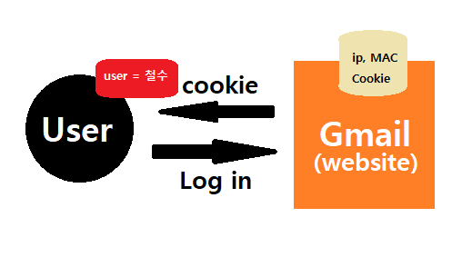

# 20191021_Modulization

## OAuth

- 회원가입 / 로그인 + 권한 관리
  - email / password 1 / password 2 / username 등
- django에서도 admin 관련하여 해본 적이 있다(createsuperuser)
- django.contrib.auth (settings.py/INSTALLED_APPS) => 이미 우리가 접해본 적이 있다.


### 회원 가입

- User라는 DB에 정보를 넣는 것 : CRUD와 거의 같다고 볼 수 있다.


### 로그인

- stateless : 무상태성 

  - HTTP는 요청/응답의 연속이나 각각은 개별적이다.

    따라서, 이때문에 로그인을 구현하는 데에 어려움을 겪을 수 있다.

  - **Cookie / Session** 이용

- User가 로그인을 할 때, 진짜 그 User인지 확인하게 하기 위해 User에게 과자 부스러기(Cookie)를 지속적으로 날려준다. (초반 로그인 원리)

  - 현재는 보안 issue 때문에 쿠키를 남기는 것을 제재하는 경우가 많아졌다.

  
  - 요즘은 이 cookie를 이용한 광고를 하기도 한다(!!!)

- Cookie

- Session : Cookie를 Tracking하는 데에 쓰지만, 로그인 정보를 함께 들고 있다.

  django의 admin은 session id를 사용하고 로그아웃을 하면 session id를 없앤다.


### 실습 ㄱㄱ

- app을 만들 때 꼭 accounts로 통일해서 간다.(**꼭 복수형으로!!!!**)
- signup.html : 회원가입도 일종의 CRUD이기 때문에, 그동안에 해왔던 CRUD를 조금 응용하면 된다.

```html



<div class="container py-3">
  <h1>회원 가입</h1>
  <form method="POST">
    
    
    
  </form>
</div>

```

- views.py
  - 회원가입 ModelForm : UserCreationForm
  - 로그인 ModelForm : AuthenticationForm

```python
from django.shortcuts import render, redirect
from django.contrib.auth.forms import UserCreationForm, AuthenticationForm
# from IPython import embed

def signup(request):
    if request.method == 'POST':
        form = UserCreationForm(request.POST)
        # embed()
        if form.is_valid():
            form.save()
            return redirect('articles:index')
    else:
        form = UserCreationForm()
    context = {
        'form': form,
    }
    return render(request, 'accounts/signup.html', context)

```

- UserCreationForm(회원가입) & AuthenticationForm(로그인)
  - User에 대한 CRUD
  - Session에 대한 CRUD

**login_required**

```python
from django.contrib.auth.decorators import login_required # 매 페이지마다 인증하기 어려우므로 이 decorator를 이용한다.

@login_required
def create(request):
    # if not request.user.is_authenticated: # is_anonymous로 해도 된다.
    #     return redirect('accounts:login')
    
    '''
    blar blar
    '''
```

만약 페이지 name을 default값과 다르게 만들었다면

```python
# settings.py 맨 밑에 적으면 된다.
LOGIN_URL = '/accounts/log_in/'
```

```python
# 또는 이렇게
@login_required(login_url='/accounts/login')
def create(request):
    '''
    blar blar
    '''
```


**탈퇴**

```python
@require_POST
def delete(request): # 회원탈퇴 / user를 DB에서 삭제
    if request.method == 'POST':
        request.user.delete()
        return redirect('accounts:signup')
```


## 기타

- 기술면접 단골 질문 : Cookie와 Session에 대해 말하세요. (Web)
- AbstractBaseUser -> AbstractUser -> User
  - Why? 모듈화를 하면 할수록 Customize 하기가 좋아진다.
  - 가장 중요한 정보들은 AbstractBaseUser 클래스에서 다루게 된다.

- IPython > embed() : valid한 값이 들어왔는지 확인하는 모듈

- html에서 form 태그에 action이 없는 경우 정보를 자기자신 url로 보낸다.
-  : url generator라고 한다