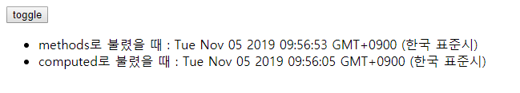

# 20191105_Vue.js Data & Component

## Vue.js 기초 복습

###  Vue의 구조 

```javascript
const app = new Vue({
    // Vue 인스턴스(ViewModel)가 어떤 HTML 요소에 마운트될지(적용될지)
    el: '#app',
    
    // Vue 인스턴스가 사용할 data
    data: {},
    
    // Vue 인스턴스가 사용할 methods
    methods: {
        //함수 정의
    },
    computed: {} // 오늘 배울 것
    
    watch:{
    	[지켜 볼 Data]: {
              handler method 정의(지켜볼 data가 변경되었을 때 실행할 함수)
        }
	} // 오늘 배울 것
})
```

 

### Vue Directive

- `v-for`
- `v-if` `v-else` `v-else-if`
- `v-model`
- `v-on:[이벤트]` 또는 `@[이벤트]`
- `v-bind:[html속성이름]` 또는 `:[html속성이름]``
- ``v-html` : 앞으로 배울 것
- `v-text` : 앞으로 배울 것
- `v-show` : 앞으로 배울 것

---

**여기까지만 알아도 Vue의 기초는 완벽하게 다졌다고 할 수 있음**

---

## Vue.js 계속

### computed

- 미리 계산된 값을 반환 -> caching

```html
<p>{{ newTodo.split('').reverse().join('') }}</p>
```

- split('')
- reverse()
- join('')
- 최대한 계산은 Vue에게 맡기고 우리는 뿌려주기만 하는 것이 좋음
  - 이는 Django에서 views.py에 기능을 최대한 만들고, html 문서에서는 보여주기만 하는 것과 비슷

```html
<p>{{ reversedNewTodo }}</p>

<!-- 생략 -->

computed: {
    reversedNewTodo () {
    	return this.newTodo.split('').reverse().join('')
	}
},
```


### methods vs. computed

- methods : Data 자체를 바꿔야 할 때
- computed : Data 가지고 단순 연산만 할 때

```html
<!DOCTYPE html>
<html lang="en">
<head>
  <meta charset="UTF-8">
  <meta name="viewport" content="width=device-width, initial-scale=1.0">
  <meta http-equiv="X-UA-Compatible" content="ie=edge">
  <title>Document</title>
</head>
<body>
  <div id="app">
    <button @click="visible = !visible">toggle</button>
    <ul v-if="visible">
      <li>methods로 불렸을 때 : {{ dateMethod() }}</li> <!-- methods는 함수 호출하듯이 -->
      <li>computed로 불렸을 때 : {{ dateComputed }}</li> <!-- computed는 함수 호출이 아닌 data 값처럼 -->
    </ul>
  </div>
  <script src="https://cdn.jsdelivr.net/npm/vue/dist/vue.js"></script>
  <script>
    const app = new Vue({
      el:'#app',
      data: {
        visible: true,
      },
      methods: {
        dateMethod() {
          return new Date()
        }
      },
      computed: {
        dateComputed() {
          return new Date()
        }
      },
    })
  </script>
</body>
</html>
```



- computed는 Caching을 하기 때문에 toggle버튼을 눌러도 이전 값만 나온다.


### 데이터 영구화(Data persist)

- 개발자 도구의 Application : Browser 내에 있는 아주 간단한 Data 저장소
  - 그 중 Local Storage -> ip 주소 선택해보면 Key-Value Pair의 테이블을 확인 가능
- 브라우저가 켜져 있는 동안에 쓸 data를 저장하는 건 **Session**
- Console 창에 localStorage를 입력하면 현재 Storage 상태를 알 수 있다.

**localStorage API**

```js
// Create
localStorage.setItem('key', 'value')

// Read
localStorage.getItem('key')

// Delete
localStorage.removeItem('key')

// Count
localStorage.length
```

- Local Storage의 Key는 table명이고, Value에 Data들의 Key-Value set이 object로 들어간다. (*주의!*)
- Value에는 꼭 String으로 넣어줘야 하므로 stringify를 해줘야 한다.


### watch

- Vue 인스턴스의 data 변경을 관찰하고 이에 반응하는 것을 정의하는 곳


## Vue.js Component

### fake trello 만들기

- **Component** : 소프트웨어에서 비슷하지만 독립적으로 사용되는 기능
  - ex) **Trello의 Categories** : 각 카테고리는 비슷한 기능을 하지만, 서로 다르게 사용
- 

```html
  <script>
    Vue.component(컴포넌트 이름, {컴포넌트 속성})
    // 컴포넌트 이름은 kebab-case나 PascalCase로
    // property로 el 빼고 다 들어갈 수 있다. + templete
  </script>
```

- 후에 component 이름을 태그로 사용할 수 있다.

```html
<todo-list></todo-list>
```

- **Component Props**
  - 각 component에도 다른 부분이 생길 수 있기 때문에, 이에 대한 제어를 props를 통해 한다.
    - app -- (porps) --> component
    - component --($emit)--> app

```js
props: ['category'], // props는 list로 해도 되지만,
props: {},
// props와 자료형으로 묶어 object로 보내는 것이 좋다.(strictly)
// Validation도 해주는 효과가 있다.

// 옵션까지 추가할 수 있으며
// django의 model와 비슷
// 나중에 견고한 app을 만들기 위해 이렇게 strictly 만들면된다.
props: {
    category: {
        type: String,
        required: true,
        validator: function(value) {
            if (value.length !== 0){
                return true
            } else {
                return false
            }
        }
    }
}
```

- single file component는 내일 할 것 :)


## 기타

- key-value pair
  - python : dictionary
  - javascript : object
- 현재 자주 쓰이는 JS Framework들은 Component-based UI가 포함되어 있다.
- kebab-case / PascalCase